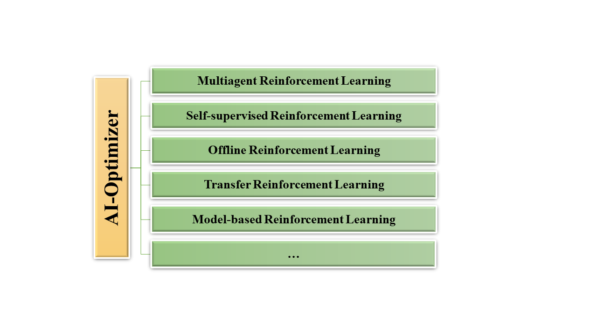

# AI Optimizer

AI-Optimizer is a next-generation deep reinforcement learning suit, providing rich algorithm libraries ranging from model-free to model-based RL algorithms, from single-agent to multi-agent algorithms. Moreover, AI-Optimizer contains a flexible and easy-to-use distributed training framework for efficient policy training.

AI-Optimizer now provides the following built-in libraries, and more libraries and implementations are coming soon.

* [Taxonomy](libraries/index.md)
    * [Multiagent Reinforcement learning](libraries/MARL/index.md)
    * [Self-supervised Representation Reinforcement Learning](libraries/SSRL/index.md)
    * [Offline Reinforcement Learning](libraries/Offline_RL/index.md)
    * [Transfer and Multi-task Reinforcement Learning](libraries/Transfer_RL/index.md)
    * [Model-based Reinforcement Learning](libraries/MBRL/index.md)

