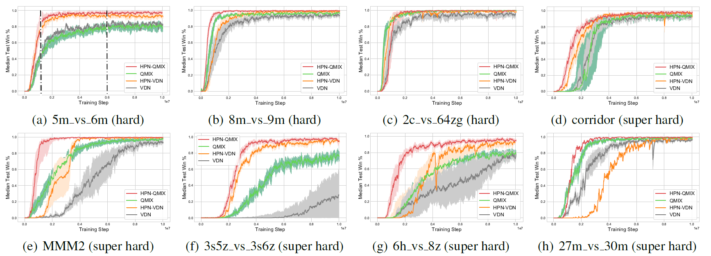
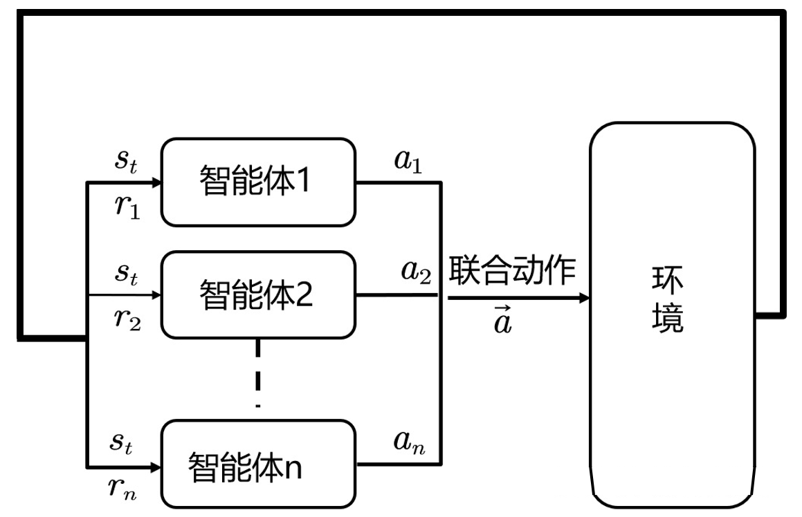
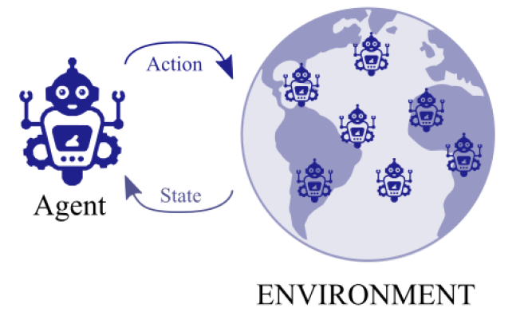

# Multiagent RLlib: A unified official code releasement of MARL researches made by TJU-RL-Lab

This repository contains the released codes of representative research works of TJU-RL-Lab on the topic of Multiagent Reinforcement Learning (MARL). The research topics are classified according to the critical challenges of MARL, e.g., the curse of dimensionality (scalability) issue,  non-stationarity, multiagent credit assignment, exploration–exploitation tradeoff and hybrid action. 

This repository will be constantly updated to include new research works.  

## 1. Key Features

The main contribution of this repository is that:

- **For beginners** who are interested in MARL,  our [easy-marl](https://github.com/TJU-DRL-LAB/AI-Optimizer/tree/main/multiagent-rl/easy-marl) codebase and ZhiHu blogs: [MARL](https://www.zhihu.com/column/c_1479535265715298304) and [communication-based MARL](https://www.zhihu.com/column/c_1431679500950560768) can be a preliminary tutorial.

- **For researchers,** we provide a systematic overview of typical challenges in MARL from different perspectives, each of which is a very valuable research direction and contains a series recent research works. We hope with our research works and the corresponding released codes can make it easier for researchers to design new algorithms. 

    - For example, given the significant interest in designing novel MARL architectures over the past few years, the research direction of [scalable multiagent networks](https://github.com/TJU-DRL-LAB/Multiagent-RL/tree/304dc434f5be947641ab8eed9857a034f3ec1507/scalability) is definitely of interest to the MARL community. More recently, the notion of *permutation-invariance* and *permutation-equivariance* in the design of MARL agents has relatively drawn less attention than deserved, and therefore the presented idea in [API paper](https://arxiv.org/pdf/2203.05285.pdf) is interesting and very relevant to MARL researchers.

- **For practitioners**,  we release a serials of **efficient, scalable, well-performed** and **easy to use** MARL algorithms which achieve superior performance in the typical benchmarks of the MARL research community. 

    - For example, the API-QMIX, API-VDN, API-MAPPO and API-MADDPG algorithms proposed in our paper ["API: Boosting Multi-Agent Reinforcement Learning via Agent-Permutation-Invariant Networks"](https://arxiv.org/pdf/2203.05285.pdf) achieve State-Of-The-Art Performance in the [StarCraft Multi-Agent Challenge (SMAC)](https://github.com/oxwhirl/smac) and [Multi-agent Particle Environment](https://github.com/openai/multiagent-particle-envs) benchmarks, which achieves **100% win-rates in almost all hard and super-hard SMAC scenarios (never achieved before)**.
    - 🚀 State-Of-The-Art Performance of our API-QMIX and API-VDN (named HPN-QMIX and HPN-VDN in the figure) in SMAC.
    
    - **We strongly recommend** that practitioners **try and use our API-Network solution FIRST** when solving practical MARL problems (because it is very easy to use and does work very well) !  We hope our works can promote the deployment and landing of MARL in more real-world applications.

## 2. Challenges of MARL

Multiagent systems consist of multiple agents acting and learning in a shared environment. Many real-world decision making problems can be modeled as multiagent systems, such as playing the game of Go, playing real-time strategy games, robotic control, playing card games, autonomous vehicles, resource allocation problems. Despite the recent success of deep RL in single-agent environments, there are additional challenges in multiagent RL:

- **The curse of dimensionality (scalability) issue**: In MARL, the joint state-action space grows exponentially as the number of agents increases. This is also referred to as the combinatorial nature of MARL. Thus, MARL algorithms typically suffer from **poor sample-efficiency** and **poor scalability** due to the exponential grows of the dimensionality. The key to solve this problem is to reduce the size of the state-action space properly. 

- **Non-stationarity** (especially for independent learners): In Markov games, the state transition function and the reward function of each agent depend on the actions of all agents. During the training of multiple agents, the policy of each agent changes through time. As a result, each agents’ perceived transition and reward functions change as well, which causes the environment faced by each individual agent to be non-stationary and breaks the Markov assumption that governs the convergence of most single-agent RL algorithms. In the worst case, each agent can enter an endless cycle of adapting to other agents. 

- **Multiagent credit assignment problem**: for cooperative Markov games, all agents could only receive a shared team reward. However, in most cases, only a subset of agents contribute to the reward, and we need to identify which agents contribute more (less) and reward (punish) them accordingly. The target is then guide the less contributed agents to contribute more and thus the team reward could be further improved.

- **Exploration–exploitation tradeoff**:  compared with the single-agent settings, the presence of multiple agents further makes the problem more complicated. First, due to the curse of dimensionality, the search space grows larger. Second, the agents explore to obtain information not only about the environment, but also about the other agents. Too much exploration, however, can disturb the learning dynamics of the other agents, thus making the learning task more difficult, especially for the cases that the agents’ choices of actions must be mutually consistent in order to achieve better rewards. Thus, coordinated exploration is needed.

- **Hybrid action**: Discrete-continuous hybrid action space is a natural setting in many practical problems, such as robot control and game AI. However, most previous Reinforcement Learning (RL) works only demonstrate the success in controlling with either discrete or continuous action space, while seldom take into account the hybrid action space.  For example, in robot soccer, the agent not only needs to choose whether to shoot or pass the ball (i.e., discrete actions) but also the associated angle and force (i.e., continuous parameters).

- **Partial observability**: In most real-world applications, the agents only have access to their local observations and not the actual state of the environment, which can significantly hinder training performance.

## 3. Our Solutions

To solve the above problems, we propose a series of algorithms from different point of views. A big picture is shown bellow. 

We briefly give an introduction about the most recent works here. Details about these methods can be found in the sub-directories.

### 3.1 The curse of dimensionality (scalability) issue

- #### API: Boosting Multi-Agent Reinforcement Learning via Agent-Permutation-Invariant Networks [[1]](https://arxiv.org/pdf/2203.05285.pdf)

  - Multi-agent reinforcement learning suffers from poor sample efficiency due to the exponential growth of the state-action space. Considering a homogeneous multiagent system, a global state consisting of $m$ homogeneous components has $m!$ differently ordered representations, thus designing functions satisfying permutation invariant (PI) can reduce the state space by a factor of $\frac{1}{m!}$. However, mainstream MARL algorithms ignore this property and learn over the original state space. To achieve PI, previous works including data augmentation based methods and embedding-sharing architecture based methods, suffer from training instability and limited model capacity. In this work, we propose two novel designs to achieve PI, while avoiding the above limitations. The first design permutes the same but differently ordered inputs back to the same order and the downstream networks only need to learn function mapping over fixed-ordering inputs instead of all permutations, which is much easier to train. The second design applies a hypernetwork to generate customized embedding for each component, which has higher representational capacity than the previous embedding-sharing method. Empirical results on the SMAC benchmark show that the proposed method achieves **100%** win-rates in almost all hard and super-hard scenarios (**never achieved before**), and superior sample-efficiency than the state-of-the-art baselines by up to **400%**.

- #### [ICLR-2020] ASN: Action Semantics Network: Considering the Effects of Actions in Multiagent Systems [[2]](https://openreview.net/forum?id=ryg48p4tPH).

  - In multiagent systems (MASs), each agent makes individual decisions but all of them contribute globally to the system evolution. Learning in MASs is difficult since each agent’s selection of actions must take place in the presence of other co-learning agents. Moreover, the environmental stochasticity and uncertainties increase exponentially with the increase in the number of agents. Previous works borrow various multiagent coordination mechanisms into deep learning architecture to facilitate multiagent coordination. However, none of them explicitly consider action semantics between agents that different actions have different influence on other agents. In this paper, we propose a novel network architecture, named Action Semantics Network (ASN), that explicitly represents such action semantics between agents. ASN characterizes different actions’ influence on other agents using neural networks based on the action semantics between them. ASN can be easily combined with existing deep reinforcement learning (DRL) algorithms to boost their performance. Experimental results on StarCraft II micromanagement and Neural MMO show ASN significantly improves the performance of state-of-the-art DRL approaches compared with several network architectures.

### 3.2 Non-stationarity

- #### [AAMAS-2019] Independent Generative Adversarial Self-Imitation Learning in Cooperative Multiagent Systems [[8]](https://www.ifaamas.org/Proceedings/aamas2019/pdfs/p1315.pdf)

  - In this work, we focus on independent learning paradigm in which each agent makes decisions based on its local observations only. However, learning is challenging in independent settings due to the local viewpoints of all agents, which perceive the world as a non-stationary environment due to the concurrently exploring teammates. In this paper, we propose a novel framework called Independent Generative Adversarial Self-Imitation Learning (IGASIL) to address the coordination problems in fully cooperative multiagent environments. To the best of our knowledge, we are the first to combine self-imitation learning with generative adversarial imitation learning (GAIL) and apply it to cooperative multiagent systems. Besides, we put forward a Sub-Curriculum Experience Replay mechanism to pick out the past beneficial experiences as much as possible and accelerate the self-imitation learning process. Evaluations conducted in the testbed of StarCraft unit micromanagement and a commonly adopted benchmark show that our IGASIL produces state-of-the-art results and even outperforms JALs in terms of both convergence speed and final performance.

### 3.3 Multiagent credit assignment problem

- #### [ICML-2020] Q-value Path Decomposition for Deep Multiagent Reinforcement Learning [[6]](http://proceedings.mlr.press/v119/yang20d/yang20d.pdf)

  - During centralized training, one key challenge is the multiagent credit assignment: how to allocate the global rewards for individual
    agent policies for better coordination towards maximizing system-level’s benefits. In this paper, we propose a new method called Q-value Path
    Decomposition (QPD) to decompose the system’s global Q-values into individual agents’ Q-values. Unlike previous works which restrict the representation relation of the individual Q-values and the global one, we leverage the integrated gradient attribution technique into deep MARL to directly decompose global Q-values along trajectory paths to assign credits for agents. We evaluate QPD on the challenging StarCraft II micromanagement tasks and show that QPD achieves the state-ofthe- art performance in both homogeneous and heterogeneous multiagent  scenarios compared with existing cooperative MARL algorithms.

### 3.4 Exploration–exploitation tradeoff

- #### PMIC: Improving Multi-Agent Reinforcement Learning with Progressive Mutual Information Collaboration [[11]](https://www.cooperativeai.com/neurips-2021/workshop-papers)

  - Learning to collaborate is critical in multi-agent reinforcement learning (MARL). A number of previous works promote collaboration by maximizing the correlation of agents' behaviors, which is typically characterised by mutual information (MI) in different forms. However, in this paper, we reveal that strong correlation can emerge from sub-optimal collaborative behaviors, and simply maximizing the MI can, surprisingly, hinder the learning towards better collaboration. To address this issue, we propose a novel MARL framework, called Progressive Mutual Information Collaboration (PMIC), for more effective MI-driven collaboration. In PMIC, we use a new collaboration criterion measured by the MI between global states and joint actions. Based on the criterion, the key idea of PMIC is maximizing the MI associated with superior collaborative behaviors and minimizing the MI associated with inferior ones. The two MI objectives play complementary roles by facilitating learning towards better collaborations while avoiding falling into sub-optimal ones. Specifically, PMIC stores and progressively maintains sets of superior and inferior interaction experiences, from which dual MI neural estimators are established. Experiments on a wide range of MARL benchmarks show the superior performance of PMIC compared with other algorithms.

## 4. Directory Structure of this Repo

an overall view of research works in this repo

| Category          | Sub-Categories                                   | Research Work (Conference) | Progress |
| :-------------------------- | :---------------------------------------------------------- | :----------------------------------- | ------------------------------------ |
| **scalability** | **scalable multiagent network**     (1) permutation invariant (equivariant)        (2) action semantics     (3) Game abstraction      (4) dynamic agent-number network  **hierarchical MARL**  | (1) [API (underreview) [1]](https://arxiv.org/pdf/2203.05285.pdf)  (2) [ASN (ICLR-2020) [2]](https://openreview.net/forum?id=ryg48p4tPH) (3) [G2ANet (AAAI-2020) [3]](https://ojs.aaai.org/index.php/AAAI/article/view/6211)  (4) [DyAN (AAAI-2020) [4]](https://ojs.aaai.org/index.php/AAAI/article/view/6221) (5) [HIL/HCOMM/HQMIX (Arxiv) [5]](https://arxiv.org/pdf/1809.09332.pdf?ref=https://githubhelp.com) | ✅|
| **credit_assignment**       |                                                             | (1) [QPD (ICML-2020) [6]](http://proceedings.mlr.press/v119/yang20d/yang20d.pdf)  (2) [Qatten (Arxiv) [7]](https://arxiv.org/abs/2002.03939) | ✅|
| **non-stationarity**       | (1) self_imitation_learning (2) opponent modeling  | (1) [GASIL (AAMAS-2019) [8]](https://www.ifaamas.org/Proceedings/aamas2019/pdfs/p1315.pdf) (2) [BPR+ (NIPS-2018) [9]](https://proceedings.neurips.cc/paper/2018/file/85422afb467e9456013a2a51d4dff702-Paper.pdf) (3) [DPN-BPR+ (AAMAS2020) [10]](https://link.springer.com/article/10.1007/s10458-020-09480-9)   | ✅|
| **multiagent_exploration**  |                                                             | [PMIC (NIPS-2021 workshop) [11]](https://www.cooperativeai.com/neurips-2021/workshop-papers) | ✅|
| **hybrid_action**           |                                                             | [MAPQN/MAHHQN (IJCAI-2019) [12]](https://arxiv.org/pdf/1903.04959.pdf?ref=https://githubhelp.com) | ✅               |
| **negotiation**    |                                                        | alpha-Nego | ✅ |

## 5. Publication List

**Scalability issue**

[1] Hao X, Wang W, Mao H, et al. API: Boosting Multi-Agent Reinforcement Learning via Agent-Permutation-Invariant Networks[J]. arXiv preprint arXiv:2203.05285, 2022.

[2] Wang W, Yang T, Liu Y, et al. Action Semantics Network: Considering the Effects of Actions in Multiagent Systems[C]//International Conference on Learning Representations. 2019.

[3] Liu Y, Wang W, Hu Y, et al. Multi-agent game abstraction via graph attention neural network[C]//Proceedings of the AAAI Conference on Artificial Intelligence. 2020, 34(05): 7211-7218.

[4] Wang W, Yang T, Liu Y, et al. From few to more: Large-scale dynamic multiagent curriculum learning[C]//Proceedings of the AAAI Conference on Artificial Intelligence. 2020, 34(05): 7293-7300.

[5] Tang H, Hao J, Lv T, et al. Hierarchical deep multiagent reinforcement learning with temporal abstraction[J]. arXiv preprint arXiv:1809.09332, 2018.

**Credit assignment**

[6] Yang Y, Hao J, Chen G, et al. Q-value path decomposition for deep multiagent reinforcement learning[C]//International Conference on Machine Learning. PMLR, 2020: 10706-10715.

[7] Yang Y, Hao J, Liao B, et al. Qatten: A general framework for cooperative multiagent reinforcement learning[J]. arXiv preprint arXiv:2002.03939, 2020.

**Non-stationarity**

[8] Hao X, Wang W, Hao J, et al. Independent generative adversarial self-imitation learning in cooperative multiagent systems[J]. arXiv preprint arXiv:1909.11468, 2019.

[9] Zheng Y, Meng Z, Hao J, et al. A deep bayesian policy reuse approach against non-stationary agents[J]. Advances in neural information processing systems, 2018, 31.

[10] Zheng Y, Hao J, Zhang Z, et al. Efficient policy detecting and reusing for non-stationarity in markov games[J]. Autonomous Agents and Multi-Agent Systems, 2021, 35(1): 1-29.

**Multiagent exploration**

[11] Li P, Tang H, Yang T, et al. PMIC: Improving Multi-Agent Reinforcement Learning with Progressive Mutual Information Collaboration[J]. 2021.

**Hybrid action**

[12] Fu H, Tang H, Hao J, et al. Deep multi-agent reinforcement learning with discrete-continuous hybrid action spaces[C]//Proceedings of the 28th International Joint Conference on Artificial Intelligence. 2019: 2329-2335.

