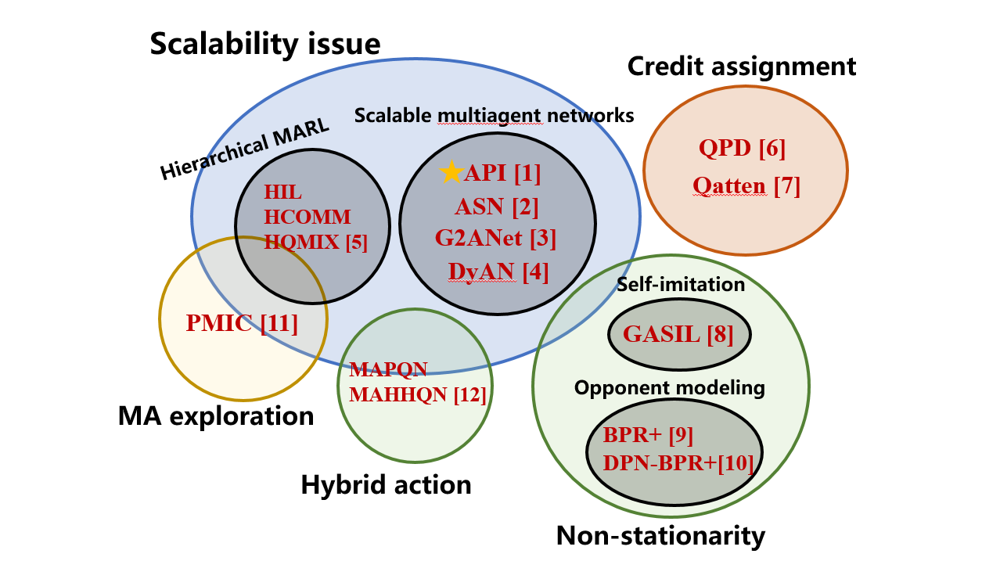

# Multiagent Reinforcement Learning (MARL)
The Multiagent RL repo contains the released codes of representative research works of TJU-RL-Lab on Multiagent Reinforcement Learning (MARL). 

## ❓ Problem to Solve

Multi-agent reinforcement learning (MARL) has successfully addressed many complex real-world problems, such as playing the game of Go ([AlphaGo](https://idp.nature.com/authorize/casa?redirect_uri=https://www.nature.com/articles/nature16961%257D&casa_token=JKjRDdaog1cAAAAA:cwpvaRtkWOQi-K-NGT2AT9bNM1kcA5NgXWU7MVIdrI6poJ8FwDxyunnDEpGaOuoUxfA4RzOumao3MqS-8mU), [AlphaGo Zero](https://www.nature.com/articles/nature24270?sf123103138=1)), playing real-time multi-player strategy games ([StarCraft II](https://www.nature.com/articles/s41586-019-1724-z?), [Dota 2](https://arxiv.org/abs/1912.06680), [Honor of Kings](https://arxiv.org/abs/2011.12895))，playing card games ([Poker](https://www.science.org/doi/abs/10.1126/science.aay2400?casa_token=YpsKCNt7LNwAAAAA:POhK0ufRyfzaHXWiywSHPk6nvzugQVsTNYdSZyteYTkRRPA4zccUvmnOBYC2DBFcIytHN9FPqZ-s6SUY), [no-limit Poker](https://www.onlinecasinoground.nl/wp-content/uploads/2018/10/Libratus-super-human-no-limit-poker-Sandholm-Brown.pdf)), [robotic control](https://arxiv.org/abs/1709.06011) and autonomous driving ([Smarts](https://arxiv.org/abs/2010.09776)). However, MARL suffers from several challenges in theoretical analysis, in addition to those that arise in single-agent RL. We summarize below the challenges that we regard as fundamental in developing theories for MARL.

- **The curse of dimensionality (scalability) issue**
- **Non-stationarity**
- **Non-Unique Learning Goals**
- **Exploration–exploitation tradeoff**
- **Multiagent credit assignment problem**
- **Partial observability**
- **Hybrid action**

Our target is to design more efficient, more scalable, well-perfomred and much easier to use MARL algorithms which could solve or alleviate the problems mentioned above and promote the deployment and landing of MARL in more real-world applications.

## ⭐️ Core Directions

We carry out our studies according to the challenges mentioned above. To solve the the curse of dimensionality issue, we design a series of scalable multiagent neural networks which could efficiently reduce the size of the search space by leveraging the [permutation invariance and permutation equivariance properties](https://arxiv.org/abs/2203.05285), explicitly taking the [action semantics](https://arxiv.org/abs/1907.11461) into consideration, etc. To better make a balance of the exploration–exploitation tradeoff, we propose Progressive Mutual Information Collaboration to achieve more efficient cooperative  exploration... An overall picture of the proposed methods is shown below.

## 💦 Contribution

The main contribution of this repository is that:

- **For beginners** who are interested in MARL,  our [easy-marl](https://github.com/TJU-DRL-LAB/AI-Optimizer/tree/main/multiagent-rl/easy-marl) codebase and ZhiHu blogs: [MARL](https://www.zhihu.com/column/c_1479535265715298304) and [communication-based MARL](https://www.zhihu.com/column/c_1431679500950560768) can be a preliminary tutorial.

- **For researchers,** we provide a systematic overview of typical challenges in MARL from different perspectives, each of which is a very valuable research direction and contains a series recent research works. We hope with our research works and the corresponding released codes can make it easier for researchers to design new algorithms. 

  - For example, given the significant interest in designing novel MARL architectures over the past few years, the research direction of [scalable multiagent networks](https://github.com/TJU-DRL-LAB/Multiagent-RL/tree/304dc434f5be947641ab8eed9857a034f3ec1507/scalability) is definitely of interest to the MARL community. More recently, the notion of *permutation-invariance* and *permutation-equivariance* in the design of MARL agents has relatively drawn less attention than deserved, and therefore the presented idea in [API paper](https://arxiv.org/pdf/2203.05285.pdf) is interesting and very relevant to MARL researchers.

- **For practitioners**,  we release a serials of **efficient, scalable, well-performed** and **easy to use** MARL algorithms which achieve superior performance in the typical benchmarks of the MARL research community. 

  - For example, the API-QMIX, API-VDN, API-MAPPO and API-MADDPG algorithms proposed in our paper ["API: Boosting Multi-Agent Reinforcement Learning via Agent-Permutation-Invariant Networks"](https://arxiv.org/pdf/2203.05285.pdf) achieve State-Of-The-Art Performance in the [StarCraft Multi-Agent Challenge (SMAC)](https://github.com/oxwhirl/smac) and [Multi-agent Particle Environment](https://github.com/openai/multiagent-particle-envs) benchmarks, which achieves **100% win-rates in almost all hard and super-hard SMAC scenarios (never achieved before)**.
  - **We strongly recommend** that practitioners **try and use our API-Network solution FIRST** when solving practical MARL problems (because it is very easy to use and does work very well) !  We hope our works can promote the deployment and landing of MARL in more real-world applications.

  See more [here](https://github.com/TJU-DRL-LAB/AI-Optimizer/tree/main/multiagent-rl).

  