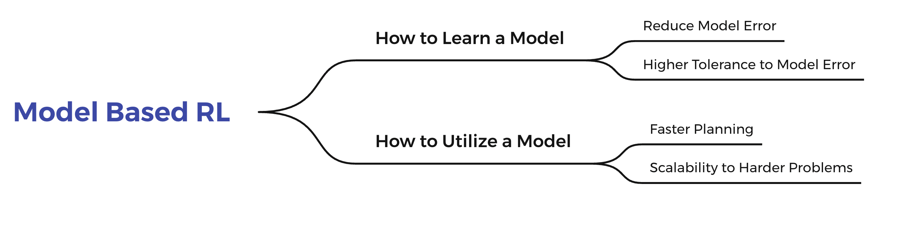

# Model-based Reinforcement Learning (MBRL)
Model-based reinforcement learning (MBRL) is widely seen as having the potential to be significantly more sample efficient than model-free RL. By learning a model of the environment, model-based methods learn with significantly lower sample complexity.The model of the environment is a representation model that explicitly contains knowledge about the environment or the task, and generally two types of models are included: a transition model or a dynamics model and the reward model. Once this model is modeled, it can be properly integrated into the interaction with the environment and the learning of strategies. 

## ❓Problems to Solve

The current classifications of the mainstream algorithms in the modern Model-Based RL area are orthogonal, which means some algorithms can be grouped into different categories according to different perspectives. In this branch, we focus on two key questions  :`How to Learn a Model` and `How to Utilize a Model`.

- `How to Learn a Model` mainly focuses on how to build the environment model. 
- `How to Utilize a Model` cares about how to utilize the learned model. 

## ⭐️ Core Directions

Ignoring the differences in specific methods, the purpose of MBRL algorithms can be more finely divided into four directions as follows: `Reduce Model Error`、`Faster Planning`、` Higher Tolerance to Model Error` 、`Scalability to Harder Problems`.  For the problem of `How to Learn a Model`, we can study on reducing model error to learn a more accurate world model or learning a world model with higher tolerance to model error. For the problem of `How to Utilize a Model`, we can study on faster planning with a learned model or the scalability of the learned model to harder problems.   

## 💦 Contributions
### Why MBRL ?

Model-based reinforcement learning (MBRL) enjoys several benefits, such as data-efficiency and planning, by learning a model of the environments dynamics. The model of the environment is a representation model that explicitly contains knowledge about the environment or the task, and generally two types of models are included: a transition model or a dynamics model and the reward model. Once this model is modeled, it can be properly integrated into the interaction with the environment and the learning of strategies. 

### Why Our Lib?

With this repo and our research works, we want to draw the attention of RL community to studies on Model Based RL.

- For people who are insterested in model based RL, our introductions in this repo and our [ZhiHu blog series](https://zhuanlan.zhihu.com/p/425318401) can be a preliminary tutorial.

- For Researchers in model-based RL, we collect several separate lines of research, which are sometimes closed-sourced or not reproducible and make some code-level optimizations for the convinience to find comparative baselines without the need to search around for implementations.

We expect that our research thoughts and proposed topic for MBRL area can open up some new angles for future works on more advanced RL. **What' more, We want to cover as many interesting new directions as possible, and then divide it into the topic we listed above, to give you some inspiration and ideas for your RESEARCH.** Research in model-based RL has not been very standardized. It is fairly common for authors to experiment with self-designed environments, and there are several separate lines of research, which are sometimes closed-sourced or not reproducible. And for this, we have collected some of the mainstream MBRL algorithms and made some code-level optimizations. Bringing these algorithms together in a unified framework can save the researchers time in finding comparative baselines without the need to search around for implementations. Currently, we have implemented Dreamer, MBPO,BMPO, MuZero, PlaNet, SampledMuZero, CaDM and we plan to keep increasing this list in the future.  We will constantly update this repo to include new research made by TJU-DRL-Lab to ensure sufficient coverage and reliability. We are also looking forward to feedback in any form to promote more in-depth researches. See more [here](https://github.com/TJU-DRL-LAB/AI-Optimizer/tree/main/modelbased-rl).
