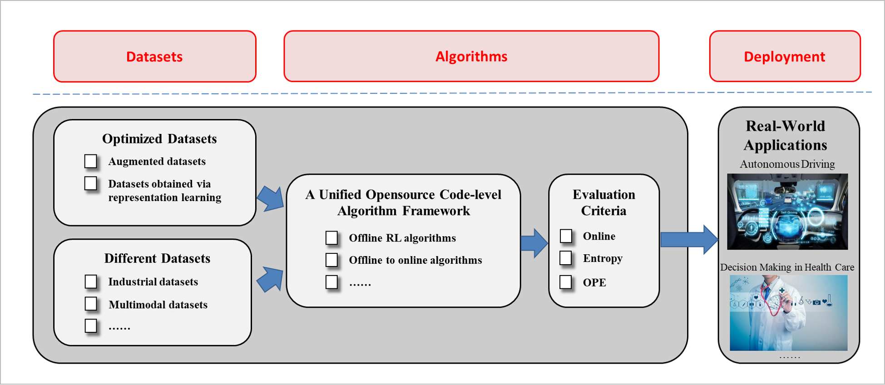

# Offline-rl-algorithms (Offrl)
## ❓ Problem to Solve
Current deep RL methods still typically rely on active data collection to succeed, hindering their application in the real world especially when the data collection is dangerous or expensive.  Offline RL (also known as batch RL) is a data-driven RL paradigm concerned with learning exclusively from static datasets of previously-collected experiences. In this setting, a behavior policy interacts with the environment to collect a set of experiences, which can later be used to learn a policy without further interaction. This paradigm can be extremely valuable in settings where online interaction is impractical. However, current offline rl methods are restricted to three challenges: 
 * Low upper limit of algorithm: The quality of offline data determines the performance of offline reinforcement learning algorithms. How to expand low-quality offline data without additional interaction to increase the learning upper limit of offline reinforcement learning algorithms?
 * Poor algorithm effect: Existing off-policy/offline algorithm trains on the offline data distribution. When interacting with the environment, the distribution of the accessed state-action may change compared with the offline data (Distributional Shift). In this situation, the Q value of the <state, action> pair is easy to be overestimated, which affects the overall performance. How to characterize the data outside the offline data distribution (Out Of Distribution, OOD) to avoid overestimation?
 * Difficulty in applying the algorithm: Due to the limited quality of the dataset, the learned strategy cannot be directly deployed in the production environment, and further online learning is required. How to design data sampling in the online training phase to avoid the sudden drop in the initial performance of the strategy due to the redundant data generated by the distribution change, and quickly converge to the optimal solution in a limited number of interactions?

## 💦 Contribution
This repository contains the codes of representative benchmarks and algorithms on the topic of Offline Reinforcement Learning. The repository is developed based on d3rlpy(https://github.com/takuseno/d3rlpy) following MIT license to shed lights on the research on the above three challenges. While inheriting its advantages, the additional features include (or will be included):
 - A unified algorithm framework with rich and fair comparisons bewteen different algorithms:
   - REDQ
   - UWAC
   - BRED
   - …
 - Abundant and real-world datasets:
   - Real-world industrial datasets
   - Multimodal datasets
   - Augmented datasets (and corresponding methods)
   - Datasets obtained using representation learning (and corresponding methods)
 - More easy-to-use log systems support: 
   - Wandb

