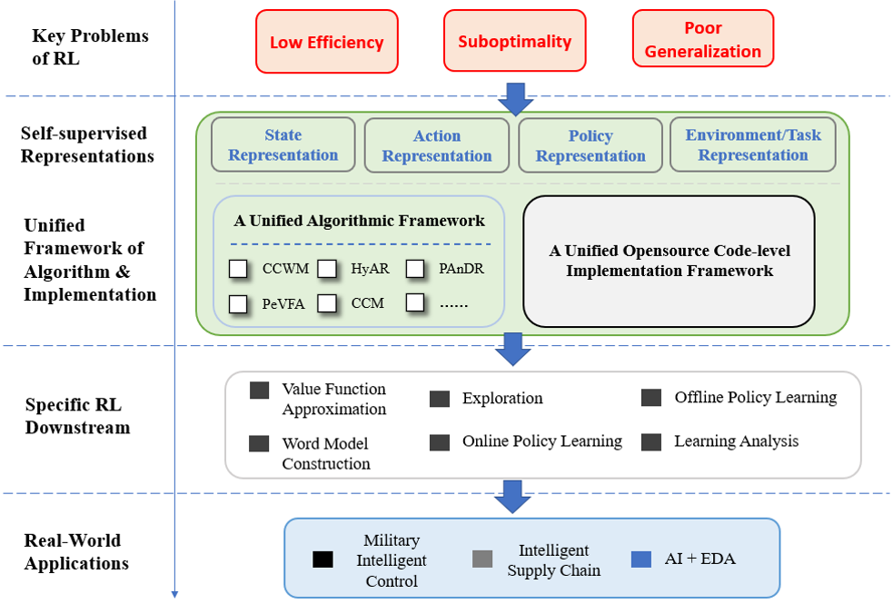

# Self-supervised Reinforcement Learning (SSRL)
SSRL repo contains the released codes of representative research works of TJU-RL-Lab on Self-supervised Representation Learning for RL. 

To the best of our knowledge, this is the **first** code repository for SSRL established by following **a systematic research taxonomy** and **a unified algorithmic framework**.

## ❓ Problem to Solve
Since the RL agent always _receives_, _processes_, and _delivers_ all kinds of data in the learning process (i.e., the typical Agent-Environment Interface), 
how to **properly represent such "data"** is naturally the key point to the effectiveness and efficiency of RL.

In this branch, we focus on **three key questions** as follows:
- **What should a good representation for RL be? (Theory)** 
- **How can we obtain or realize such good representations? (Methodology)**
- **How can we making use of good representations to improve RL? (Downstream Learning Tasks & Application)**

## ⭐️ Core Idea
Taking **Self-supervised Learning** (SSL) as our major paradigm for representation learning, we carry out our studies from four perspectives: 
- **State Representation**,
- **Action Representation**,
- **Policy Representation**,
- **Environment (and Task) Representation**.

These four pespectives are major elements involved in general _Agent-Environment Interface_ of RL.
They play the roles of _input_, _optimization target_ and etc. in the process of RL.
The representation of these elements make a great impact on the **sample efficiency**, **convergence optimality** and **cross-enviornment generalization**.

The central contribution of this repo is **A Unified Algorithmic Framework (Implementation Design) of SSRL Algorithm**.
The framework provides a unified interpretation for almost all currently existing SSRL algorithms. Moreover, the framework can also serve as a paradigm when we are going to devise new methods.

Our ultimate goal is to promote the establishment of the ecology of SSRL, which is illustrated below.

Towards addressing the key problems of RL,
we study SSRL with four types of representations.
For researches from all four pespectives, a unified framework of algorithm and imeplementation serves as the underpinnings.
The representations studied from different pespectives further boost various downstream RL tasks.
Finally, this promotes the deployment and landing of RL in real-world applications.

See more [here](https://github.com/TJU-DRL-LAB/self-supervised-rl).

## 💦 Contribution

With this repo and our research works, we want to draw the attention of RL community to studies on Self-supervised Representation Learning for RL.

- For people who are insterested in RL, our introduction in this repo and our [blogs](https://zhuanlan.zhihu.com/p/413321572) can be a preliminary tutorial.
- For cutting-edge RL researchers, we believe that our research thoughts and the proposed SSRL framework are insightful and inspiring, openning up new angles for future works on more advanced RL.
- For RL practicers (especially who work on related fields), we provide advanced RL algorithms with strong performance in online RL (e.g., [PPO-PeVFA](https://github.com/TJU-DRL-LAB/self-supervised-rl/RL_with_Policy_Representation/Policy-based_RL_with_PeVFA/PPO-PeVFA)), hybrid-action decision-making (e.g., [HyAR](https://github.com/TJU-DRL-LAB/self-supervised-rl/RL_with_Action_Representation/HyAR)), policy adaptation from offline experience (e.g., [PAnDR](https://github.com/TJU-DRL-LAB/self-supervised-rl/RL_with_Environment_Representation/PAnDR)) ..., which can be adopted or developed in associated academic and industrial problems.

We are also looking forward to feedback in any form to promote more in-depth researches.

