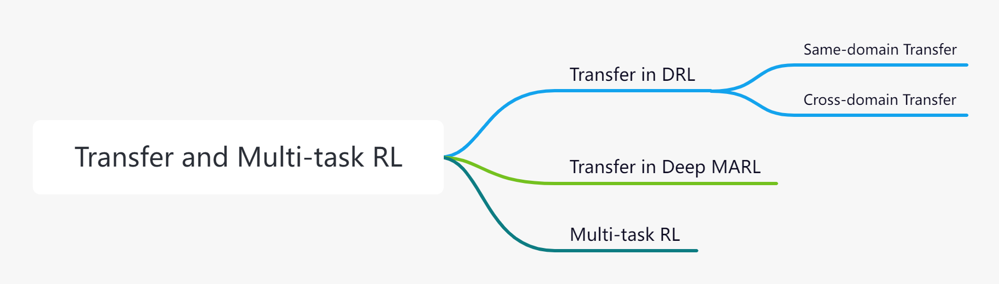

# Transfer and Multi-task Reinforcement Learning
Recently, Deep Reinforcement Learning (DRL) has achieved a lot of success in human-level control problems, such as video games, robot control, autonomous vehicles, smart grids and so on. However, DRL is still faced with the **sample-inefficiency problem** especially when the state-action space becomes large, which makes it difficult to learn from scratch. This means the agent has to use a large number of samples to learn a good policy. Furthermore, the sample-inefficiency problem is much more severe in Multiagent Reinforcement Learning (MARL) due to the exponential increase of the state-action space.  

## ❓ Problem to Solve

**Sample-inefficiency problem**: The main challenge that transfer and multi-task RL aims to solve is the sample-inefficiency problem. This problem forces the agent to collect a huge amount of training data to learn the optimal policy. For example, the Rainbow DQN requires around 18 million frames of training data to exceed the average level of human players, which is equivalent to 60 hours of games played by human players. However, human players can usually learn an Atari game within a few minutes and can reach the average level of the same player after one hour of training. 

## ⭐️ Core Idea

- **Transfer RL** which leverages prior knowledge from previously related tasks to accelerate the learning process of RL, has become one popular research direction to significantly improve sample efficiency of DRL. 

- **Multi-task RL**, in which one network learns policies for multiple tasks, has emerged as another promising direction with fast inference and good performance.

## 💦 Contribution

This repository contains the released codes of representative benchmarks and algorithms of TJU-RL-Lab on the topic of Transfer and Multi-task Reinforcement Learning, including the single-agent domain and multi-agent domain, addressing the sample-inefficiency problem in different ways.

In this repo, we provide specific solutions of our lab including:
* **PTF** addresses the **Sample-inefficiency problem** in DRL by proposing a novel Policy Transfer Framework (PTF).

* **MAPTF** addresses the **Sample-inefficiency problem** in deep MARL by proposing a Multi-Agent Policy Transfer Framework (MAPTF).

* **KTM-DRL(reproduced)** : A Knowledge Transfer based Multi-task Deep Reinforcement Learning framework (KTM-DRL) for continuous control. We reproduce the results in the MuJoCo continuous control task suite, more details can be find [here](https://github.com/TJU-DRL-LAB/transfer-and-multi-task-reinforcement-learning/tree/main/Single-agent%20Multi-task%20RL/KTM-DRL).

See more [here](https://github.com/TJU-DRL-LAB/transfer-and-multi-task-reinforcement-learning).
